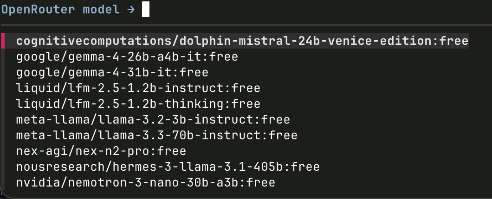

# claudeop

用**免费的 OpenRouter 模型**启动 Claude Code CLI —— 不需要 Anthropic 订阅。



一个极简的命令行工具：
- 每次启动自动从 OpenRouter 获取最新的免费模型
- 用模糊搜索器（fzf）让你选一个模型
- 直接进入 Claude Code
- **完全不影响**你原来的 `claude` 命令

```
claudeop        → 选择一个免费模型，启动 Claude Code
claude          → 你正常的 Anthropic 订阅（保持不变）
```

---

## 这是做什么的

想象一下，这就像同一个电视的两台遥控器：

| 命令 | 作用 | 谁付费 |
|------|------|--------|
| `claude` | 通过你的 Anthropic 账户使用 Claude Code | 你的 Anthropic 订阅 |
| `claudeop` | 通过 OpenRouter 的免费模型使用 Claude Code | 免费（OpenRouter） |

两者共享相同的 Claude Code 设置、插件、MCP 服务器和项目配置。唯一的区别是 **哪个模型回答你的提示**。

---

## 先决条件

开始之前，你需要确保电脑上安装了这三样东西。别担心 —— 它们都是免费的。

### 1. Claude Code CLI

Claude Code 是 Anthropic 的在终端中运行的编程助手。

**安装：**
```bash
# macOS — 在终端中粘贴并按回车
curl -fsSL https://storage.googleapis.com/claude-code/claude-code-installer.sh | sh
```

**检查是否安装成功：**
```bash
claude --version
# 应该显示类似：2.1.175
```

> 如果你已经安装了 Claude Code，跳过这一步。

---

### 2. OpenRouter 账户和 API 密钥

OpenRouter 是一个让你访问 AI 模型（包括 Claude）的服务 —— 有些是免费的。

1. 去 [openrouter.ai](https://openrouter.ai) **创建一个免费账户**
2. 登录后，进入 [Settings → API Keys](https://openrouter.ai/settings/keys)
3. 点击 **"Create Key"**
4. 复制密钥（以 `sk-or-v1-...` 开头）
5. 保存好 —— 你在第 3 步需要它

---

### 3. Homebrew（macOS 包管理器）

Homebrew 为你安装其他工具。你可能已经有了。

**检查：**
```bash
brew --version
# 如果显示版本号，说明你已经有了 —— 跳过安装
```

**如果需要安装：**
```bash
/bin/bash -c "$(curl -fsSL https://raw.githubusercontent.com/Homebrew/install/HEAD/install.sh)"
```

---

## 安装

### 第 1 步：安装 `jq` 和 `fzf`

这些是 claudeop 需要的小工具。用一个命令安装：

```bash
brew install jq fzf
```

### 第 2 步：将你的 OpenRouter API 密钥添加到 Shell

打开你的 Shell 配置文件：

```bash
nano ~/.zshrc
```

滚动到**最底部**并添加这一行（将 `sk-or-v1-YOUR_KEY_HERE` 替换为你的实际密钥）：

```bash
export OPENROUTER_API_KEY="sk-or-v1-YOUR_KEY_HERE"
```

保存并退出：
- 按 `Ctrl + O`，然后 `Enter` 保存
- 按 `Ctrl + X` 退出

然后重新加载你的 Shell：

```bash
source ~/.zshrc
```

**验证：**
```bash
echo $OPENROUTER_API_KEY
# 应该显示以 sk-or-v1- 开头的密钥
```

### 第 3 步：添加 `claudeop` 包装器

再次打开你的 Shell 配置文件：

```bash
nano ~/.zshrc
```

滚动到**最底部**并粘贴整个代码块：

```bash
# ── Claudeop: 用 OpenRouter 免费模型启动 Claude Code ──────────
#   claudeop            → 选择免费模型，启动 Claude Code
#   claudeop -m <id>    → 跳过选择器，使用特定模型
#   claude              → Anthropic 订阅（保持不变）

# 每次启动时从 OpenRouter 获取 :free 模型
_claudeop_models() {
  curl -s "https://openrouter.ai/api/v1/models" \
    -H "Authorization: Bearer $OPENROUTER_API_KEY" \
    -H "Content-Type: application/json" \
    | jq -r '[.data[] | select(.id | test(":free"))] | sort_by(.id) | .[].id' 2>/dev/null
}

claudeop() {
  if [[ -z "$OPENROUTER_API_KEY" ]]; then
    echo "❌ OPENROUTER_API_KEY 未设置"
    return 1
  fi
  local model=""
  local skip_picker=0
  local args=("$@")
  while [[ $# -gt 0 ]]; do
    case "$1" in
      -m) model="$2"; skip_picker=1; shift 2 ;;
      --model) model="$2"; skip_picker=1; shift 2 ;;
      *) shift ;;
    esac
  done
  if [[ $skip_picker -eq 0 ]]; then
    local models="$( _claudeop_models )"
    if [[ -z "$models" ]]; then
      echo "❌ OpenRouter 上没有找到模型"; return 1
    fi
    model=$(echo "$models" | fzf --prompt="OpenRouter 模型 → " --height=~40% --reverse --no-info)
    if [[ -z "$model" ]]; then
      echo "已取消"; return 0
    fi
  fi
  echo "🟢 OpenRouter → [$model]"
  ANTHROPIC_API_KEY="" \
  ANTHROPIC_BASE_URL="https://openrouter.ai/api" \
  ANTHROPIC_AUTH_TOKEN="$OPENROUTER_API_KEY" \
  ANTHROPIC_DEFAULT_OPUS_MODEL="$model" \
  ANTHROPIC_DEFAULT_SONNET_MODEL="$model" \
  ANTHROPIC_DEFAULT_HAIKU_MODEL="$model" \
  CLAUDE_CODE_SUBAGENT_MODEL="$model" \
  claude "${args[@]}"
}
```

保存并退出（`Ctrl + O`，`Enter`，`Ctrl + X`），然后重新加载：

```bash
source ~/.zshrc
```

### 第 4 步：测试

```bash
claudeop
```

你应该看到一个**模糊选择器**列出免费模型。用方向键选择一个，按 `Enter`，Claude Code 就会用该模型启动。

注意横幅：
```
🟢 OpenRouter → [nex-agi/nex-n2-pro:free]
```

你进来了！输入你的提示词开始使用。

---

## 使用方法

### 正常模式（每次选择模型）
```bash
claudeop
```
出现免费模型列表。方向键浏览，输入过滤，`Enter` 选择。

### 使用特定模型（跳过选择器）
```bash
claudeop -m "google/gemma-3-27b-it:free"
```

### 你的常规 Claude（订阅）
```bash
claude
```
和以前完全一样。不受影响。

---

## 工作原理（好奇宝宝版）

```
claudeop
  │
  ├─ 从 OpenRouter API 获取免费模型
  ├─ 用 fzf（模糊选择器）显示它们
  ├─ 你选择一个
  └─ 用这些环境变量启动 `claude`（仅该次会话）：
       ANTHROPIC_BASE_URL = https://openrouter.ai/api
       ANTHROPIC_AUTH_TOKEN = 你的 OpenRouter 密钥
       ANTHROPIC_API_KEY = ""（置空以避免冲突）
       ANTHROPIC_DEFAULT_OPUS_MODEL = 你选择的模型
       ANTHROPIC_DEFAULT_SONNET_MODEL = 你选择的模型
       ANTHROPIC_DEFAULT_HAIKU_MODEL = 你选择的模型
       CLAUDE_CODE_SUBAGENT_MODEL = 你选择的模型
```

你的 Shell 环境**永远不会被修改**。这些环境变量只存在于那个 Claude Code 进程中。退出时就消失了。

---

## 故障排除

### "❌ OPENROUTER_API_KEY 未设置"
你的 API 密钥不在 Shell 中。回到第 2 步，确保你将 `export` 行添加到了 `~/.zshrc` 并运行了 `source ~/.zshrc`。

### "❌ OpenRouter 上没有找到模型"
- 检查网络连接
- 你的 API 密钥可能无效 —— 在 [openrouter.ai/settings/keys](https://openrouter.ai/settings/keys) 重新创建一个
- `:free` 过滤器可能太严格 —— 临时测试运行：
  ```bash
  curl -s https://openrouter.ai/api/v1/models \
    -H "Authorization: Bearer $OPENROUTER_API_KEY" \
    | jq '.data | length'
  ```
  如果打印的数字 > 0，你的密钥是有效的。

### 选择器为空 / 没有显示模型
OpenRouter 上的免费模型来来去去。稍后再试 —— 新的免费模型经常出现。

### Claude Code 显示身份验证冲突警告
如果你之前用你的 Anthropic 账户登录过 Claude Code：
1. 在 Claude Code 中运行 `/logout`
2. 退出 Claude Code
3. 再次尝试 `claudeop`

### 模型不工作 / 使用时出错
免费模型有局限性。有些不支持工具使用、长上下文或 Claude Code 的高级功能。从选择器中尝试不同的免费模型。

---

## 卸载

从 `~/.zshrc` 中删除 `claudeop` 代码块：

```bash
nano ~/.zshrc
# 删除以下所有内容，包括：
# "# ── Claudeop: 用 OpenRouter 免费模型启动 Claude Code ──────────"
# 和结尾的 "}"
```

然后可选地删除 API 密钥行：

```bash
# 如果你不在其他地方使用 OpenRouter，也删除这行：
export OPENROUTER_API_KEY="sk-or-v1-..."
```

重新加载：
```bash
source ~/.zshrc
```

你的常规 `claude` 命令不受影响。

---

## 许可证

MIT